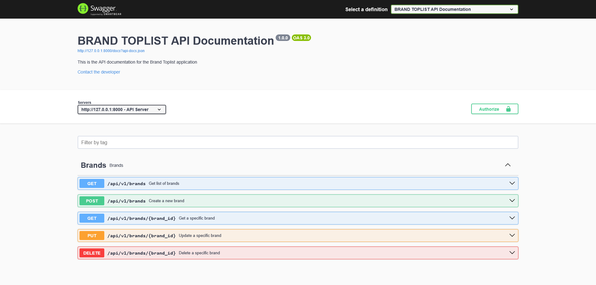
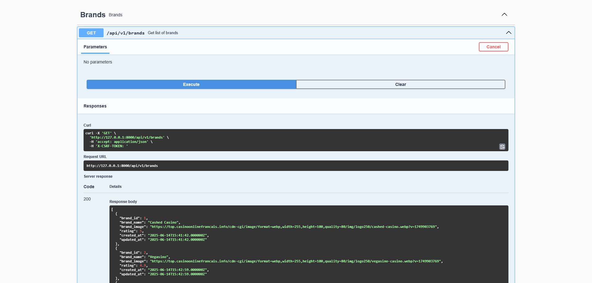

# Brand Toplist Backend

This project provides the backend for the Brand Toplist application.

## Deployment with Docker

### Prerequisites

- [Docker](https://www.docker.com/get-started) installed on your machine.

### Steps

1. **Clone the repository:**
    ```bash
    git clone https://github.com/helroygerman/brand-toplist-backend.git
    cd brand-toplist-backend
    ```

2. **Build the Docker image:**
    ```bash
    docker build -t brand-toplist-backend .
    ```

3. **Run the Docker container:**
    ```bash
    docker run -d -p 8000:8000 --name brand-toplist-backend brand-toplist-backend
    ```

    - The backend will be accessible at `http://localhost:8000`.

### Environment Variables

If your application requires environment variables, create a `.env` file in the project root and add the necessary variables. You can pass them to Docker using:

```bash
docker run --env-file .env -d -p 8000:8000 brand-toplist-backend
```

## Screenshots





## Folder Structure

### Stopping the Container

```bash
docker stop brand-toplist-backend
docker rm brand-toplist-backend
```

---

## License

This project is licensed under the [MIT License](LICENSE).

## Contact
Developer : German SONKOUE
For questions or feedback, please contact [yimhelgerman@gmail.com](mailto:yimhelgerman@gmail.com).